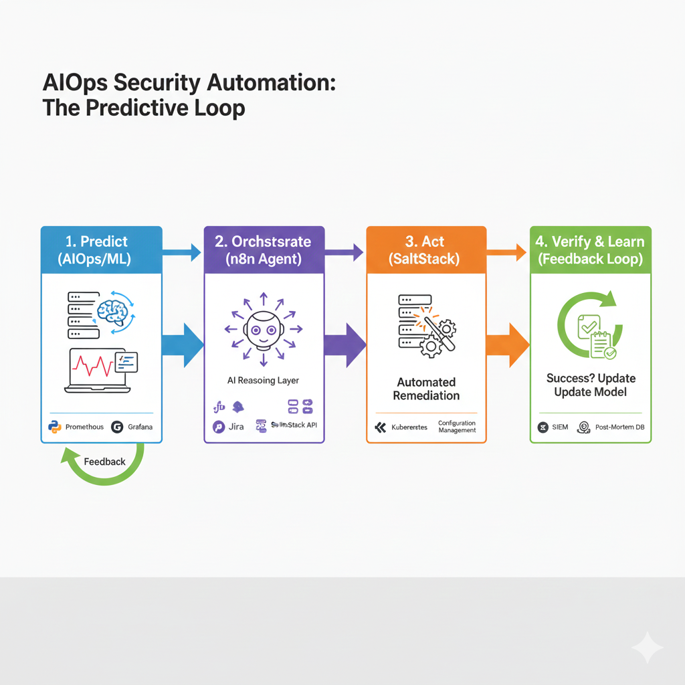

# AIOps Network Anomaly Detection

This project implements a complete AIOps lifecycle for detecting network traffic anomalies. It uses an unsupervised **Isolation Forest** model to identify suspicious behavior in real-time telemetry.


## 🚀 Project Overview

The system is designed to provide security teams with automated insights into network traffic, identifying "unknown unknown" anomalies that traditional rule-based systems might miss.

### 🏗️ Architecture
- **Training:** Google Colab-friendly Jupyter Notebook for high-performance training without local GPU requirements.
- **Inference Server:** FastAPI REST API providing real-time scoring.
- **Agent Simulation:** Python-based telemetry generator to simulate live network data streams.
- **Data Collection Agent:** Standalone Windows `.exe` for capturing live traffic, correlating processes (including IIS), and scheduling collection.
- **Deployment:** Fully containerized via Docker for portable and consistent execution.

### 🔄 Data Flow
The following diagram illustrates the end-to-end processing pipeline, from packet capture to anomaly detection:



1.  **Capture**: The `Collector` agent captures live network packets and correlates them with process metadata (PID, User, IIS AppPool).
2.  **Transmission**: Events are securely sent to the `Inference API` via REST (secured with API Key).
3.  **Inference**: The API preprocesses the data and passes it to the **Isolation Forest** model.
4.  **Action**: The model assigns an anomaly score; high scores trigger immediate alerts.

---

## 📂 Folder Structure
```text
KodiakAI/MachineLearning/
├── api/                    # FastAPI application and dependencies
├── data/                   # Raw network telemetry (CSV)
├── ml/
│   ├── models/             # Exported model artifacts (.joblib)
│   └── notebooks/          # Colab training notebook
├── scripts/
│   ├── build_exe.py        # Packaging script for the collector
│   ├── collector.py        # Network capture agent source
│   ├── mock_event_sender.py # Mock telemetry generator
│   └── requirements_collector.txt
├── dist/                   # Compiled standalone executables
├── tests/                  # Automated test suite
├── Dockerfile              # API container definition
└── docker-compose.yml      # Orchestration definition
```

---

## 🛠️ Getting Started

### 1. Phase 1: Model Training
1. Open the [training_notebook.ipynb](./ml/notebooks/training_notebook.ipynb) in **Google Colab**.
2. Upload `data/network_traffic_data.csv` when prompted.
3. Run all cells to train the model and download `anomaly_model.joblib`.
4. Place the downloaded model in the `./ml/models/` directory.

### 2. Phase 2 & 4: Deployment
You can run the API locally or via Docker.

**Using Docker (Recommended):**
```bash
docker compose up --build -d
```
The API will be available at `http://localhost:8000`.

### 3. Phase 3: Live Simulation
Start the mock telemetry agent to stream events to the API:
```bash
# Ensure you have requirements installed
pip install pandas requests
python scripts/mock_event_sender.py
```

---

## 📡 Live Data Collection (Collector Agent)

The project includes a production-ready collector agent designed to run on Windows servers or clients.

### Features
- **Process Correlation**: Automatically maps network packets to the initiating process.
- **IIS Support**: Specifically identifies the Application Pool for `w3wp.exe` worker processes.
- **Scheduling**: Define `--start-date` and `--end-date` for long-term (e.g., 1-week) capture.
- **Windows Event Log**: Logs lifecycle events and errors for system auditing.

### Usage
Run the standalone executable as **Administrator**:
```powershell
# Default run (indefinite)
.\dist\KodiakAiOps-Collector.exe

# Scheduled run
.\dist\KodiakAiOps-Collector.exe --start-date 2025-12-21 --end-date 2025-12-28
```

To build from source:
```powershell
# 1. Run the setup script (as Administrator) to install Npcap and dependencies
.\scripts\setup_collector.ps1

# 2. Build the executable
python scripts/build_exe.py
```
*Note: Requires [Npcap](https://npcap.com/) to be installed on the host. The setup script will handle the download for you.*

---

## 🧪 Testing
The project includes a `pytest` suite to verify the API and inference logic.

**Automated Verification (Recommended):**
The project includes a comprehensive PowerShell script that verifies the entire pipeline (Environment, Model, API, and Live Simulation).

```powershell
.\scripts\Invoke-AppTest.ps1
```

**Manual Test Execution:**
1. Ensure the API is running (Locally or in Docker).
2. Install test dependencies:
   ```bash
   pip install pytest requests
   ```
3. Run the tests:
   ```bash
   python -m pytest tests/test_api.py
   ```

---

## 📊 Test Results & Findings
The system has been verified through automated testing and live telemetry simulation.

- **Automated Tests**: All 4 core test cases passed (Root accessibility, Normal inference, Schema validation, Logic verification).
- **Simulation**: Confirmed stable throughput and accurate anomaly logging during randomized traffic bursts.
- **Model Performance**: Isolation Forest inference latency is sub-millisecond, suitable for high-frequency AIOps environments.

For more details, see [TEST_RESULTS.md](./TEST_RESULTS.md).

---

## 🛡️ Security & AIOps Features
- **API Security:** All write operations (`POST /event`) require an **API Key**.
  - Default Dev Key: `dev-secret-key-123`
  - Header: `X-API-Key: <your-key>`
  - Production: Set `AIOPS_API_KEY` environment variable.
- **Pydantic Validation:** Strict enforcement of the network telemetry schema.
- **Structured Logging:** Anomalies are logged with feature scores for auditability.
- **Behavioral Detection:** Uses unsupervised learning to detect shifts in traffic patterns (e.g., unusual ports or byte volumes).

---

**Developed for KodiakAI - AIOps Security Suite**
